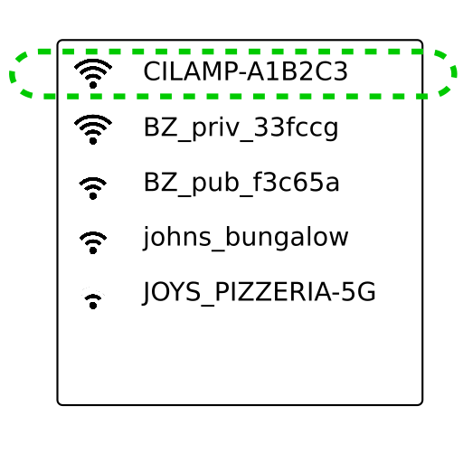
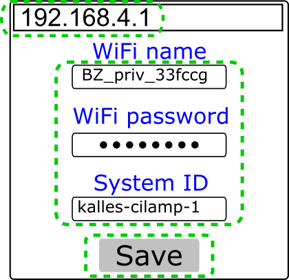

.. documents how to configure a beacon

.. raw:: html

    

.. role:: blue

.. role:: purple

.. role:: green

First time setup
================

Configure via WiFi
------------------

You can setup a BI-Beacon using a mobile or desktop device that connects to the Beacons own setup web page.

+------------+--------------------------------------------------------+
|           Instructions                                              |
+============+========================================================+
|            |                                                        |
|            | 0. Find your WiFi credentials (password and WiFi name) |
|  |image1|  | 1. Plugin your BI-Beacon (it turns blue)               |
|            | 2. Disable cellular network (if on mobile device)      |
|            | 3. Wait up to 30 seconds until BI-Beacon starts        |
|            |    shifting between blue and green                     |
|            |    (this means setup mode is active)                   |
|            |                                                        |
+------------+--------------------------------------------------------+
|  |image2|  |                                                        |
|            | 4. Connect to WiFi “``BI-Beacon-A1B2C3``”              |
|            |    (where ``A1B2C3`` is unique for your Beacon)        |
|            |                                                        |
+------------+--------------------------------------------------------+
|  |image3|  |                                                        |
|            | 5. Browse to BI-Beacon’s Setup Page:                   |
|            |    http://192.168.4.1                                  |
|            |                                                        |
|            |    **Note:** *You may need to reload the page a        |
|            |    couple of times to 'wake up' the web server*        |
|            |                                                        |
|            | 6. Enter details                                       |
|            |                                                        |
|            |    a. WiFi name: the WiFi lamp should connect          |
|            |    to (also known as SSID)                             |
|            |                                                        |
|            |    b. WiFi password: password of WiFi to connect       |
|            |    to (leave empty if no password)                     |
|            |                                                        |
|            |    **Note:** *If you bought your Beacon before         |
|            |    September 2019, or have firmware version 0.89 or    |
|            |    older, the Beacon will not handle % (per cent)      |
|            |    in the WiFi password field due to a bug.*           |
|            |                                                        |
|            |    c. Channel key: the string identifier controlling   |
|            |    the beacon state                                    |
|            |    (read more in the  :ref:`ref_api` section)          |
|            |                                                        |
|            |    *Optional settings available from firmware version  |
|            |    0.84 and upwards:*                                  |
|            |                                                        |
|            |    d. State server: The channel state server to connect|
|            |    to.                                                 |
|            |    Default: api.bi-beacon.com                          |
|            |                                                        |
|            |    e. Port: The TCP port to connect to on              |
|            |    the channel state server. Default: 4040.            |
|            |                                                        |
+------------+--------------------------------------------------------+
|  |image4|  |                                                        |
|            |  7. This should then happen:                           |
|            |                                                        |
|            |     a. The Beacon will turn :blue:`blue` meaning it    |
|            |        is trying to connect to the router              |
|            |                                                        |
|            |     b. It will turn :purple:`purple` which means it is |
|            |        connecting to state server                      |
|            |                                                        |
|            |     c. Then it will turn :green:`green`                |
|            |        if all goes well!                               |
|            |                                                        |
+------------+--------------------------------------------------------+

Configure via USB cable
-----------------------

You can also setup a BI-Beacon using a USB data cable.
(This, however, requires that your user is on a Linux
machine and has the proper permissions (often this
means being part of the ``dialout`` user group.)

Clone the cli repo (see :ref:`ref_repositories`).

Then, in a terminal of your choice,

   $ python config_via_usb.py <ssid> <password> <channelkey> [stateserver] [port]

Reset configuration
-------------------

If you want to go back to default settings, for example if
you forgot the channel key you specified previously, hold
down the FLASH button at least seven seconds. The Beacon
will show a yellow light during this process, and green
when the settings have been reset.

.. note:: The reset via FLASH is only available in firmware 0.87 and higher.

          To reconfigure a Beacon with firmware 0.86 or lower,
          reboot it whilst it cannot connect to the router.

          E.g by doing any of the following:

          1. Change SSID or password on the router
          2. Turn off the router temporarily
          3. Move the BI-Beacon far away from the router

          When you plug it in again, the Beacon will try to connect and
          fail. It will then go into setup mode again.
